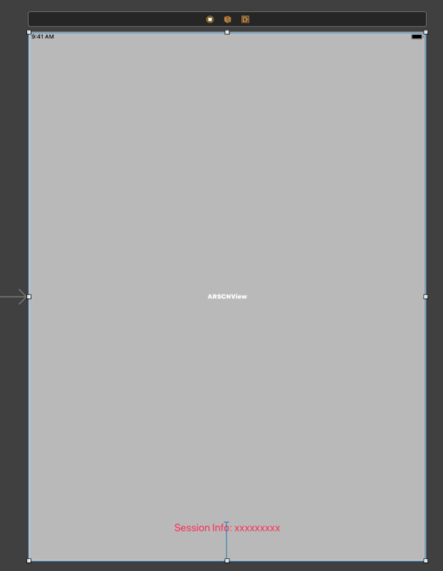
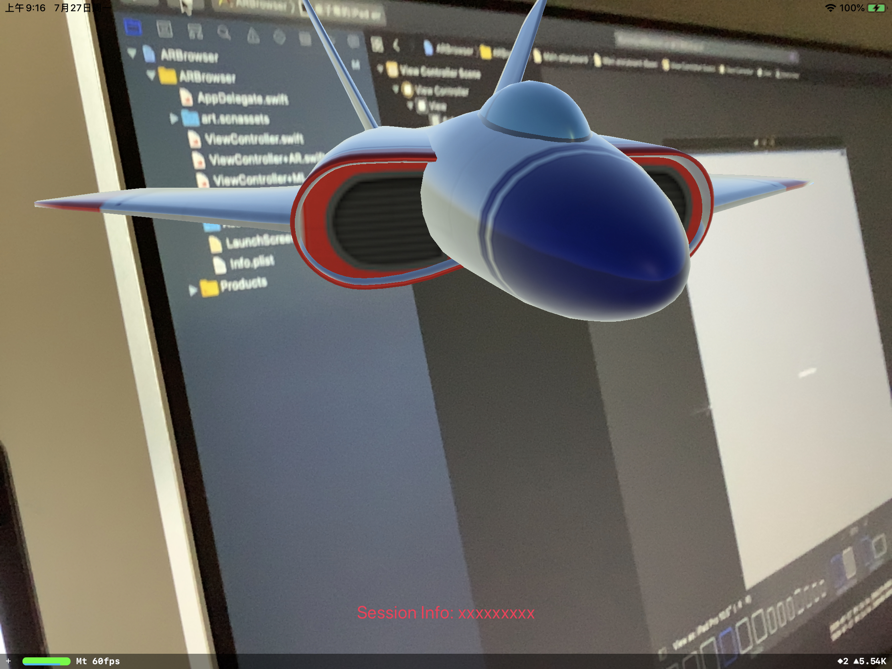

# CoreML + ARKit + SceneKit: 开发一个可交互的AR场景应用
#ios/arkit学习

## 介绍
这次开发一个通过手势识别模型来进行交互的AR应用，可以通过手势控制页面的翻滚。


## 项目准备
新建项目时仍然选择Argumented Reality App
之前App开发把主要的功能都放在了ViewController.swift中，导致单个文件过大，不够整洁，这次我们将AR和ML两个功能的函数分别放到ViewController+AR.swift和ViewController+ML.swift中。


然后是UI设计，只需要简单的添加一个Session Info的label，显示一些Debug信息。



运行测试：




## 识别一个平面
首先需要识别一个平面来放置网页的信息。

``` swift
func initAR() {
        sceneView.debugOptions = [.showFeaturePoints]
        let configuration = ARWorldTrackingConfiguration()
        configuration.planeDetection = .horizontal
        configuration.isLightEstimationEnabled = true
        
        sceneView.session.run(configuration, options: [.resetTracking, .removeExistingAnchors])
    }
```

``` swift
override func viewWillAppear(_ animated: Bool) {
        super.viewWillAppear(animated)
        
        self.initAR()
    }
```

``` swift
func renderer(_ renderer: SCNSceneRenderer, didAdd node: SCNNode, for anchor: ARAnchor) {
    // 在场景的Node被添加之后应该做的
        if let planeAnchor = anchor as? ARPlaneAnchor, node.childNodes.count<1{
            let plane = SCNPlane(width:CGFloat(planeAnchor.extent.x), height: CGFloat(planeAnchor.extent.z))
            
            plane.firstMaterial?.diffuse.contents = UIColor.blue
            planeNode = SCNNode(geometry: plane)
            planeNode.simdPosition = SIMD3(planeAnchor.center.x, 0, planeAnchor.center.z)
            // 如果不旋转，则平面就是竖直的
            // planeNode.eulerAngles.x = -.pi / 2.0
            node.addChildNode(planeNode)
        }
    }
```
运行测试一下，可以正确识别一个平面


## 在AR场景中放置Web页面
然后我们将平面替换为网页内容

``` swift
func renderer(_ renderer: SCNSceneRenderer, didAdd node: SCNNode, for anchor: ARAnchor) {
    // 在场景的Node被添加之后应该做的
        if let planeAnchor = anchor as? ARPlaneAnchor, node.childNodes.count<1{
            DispatchQueue.main.async {
                self.sessionInfoLabel.isHidden = true
                let url:URL = URL(string:"https://www.apple.com")!
                self.webView.loadRequest(URLRequest(url: url))
            }
            let browserPlane = SCNPlane(width: 1.0, height: 0.75)
            browserPlane.firstMaterial?.diffuse.contents = webView
            browserPlane.firstMaterial?.isDoubleSided = true
                
            let browserPlaneNode = SCNNode(geometry: browserPlane)
            browserPlaneNode.simdPosition = SIMD3(planeAnchor.center.x, 0, planeAnchor.center.z-1.0)
            node.addChildNode(browserPlaneNode)
            sceneView.debugOptions = []
        }
    }
```

注意这里使用的webView是UIWebView，而最新版的WKWebView和ARKit是不能一起工作的，详情见
https://stackoverflow.com/questions/49954789/how-to-display-web-page-in-arkit-ios
网页展示效果：


## 添加CoreML功能
我们使用的是来自[Gesture-Recognition-101-CoreML-ARKit/example_5s0_hand_model.mlmodel at master · hanleyweng/Gesture-Recognition-101-CoreML-ARKit · GitHub](https://github.com/hanleyweng/Gesture-Recognition-101-CoreML-ARKit/blob/master/Gesture-Recognition-101-CoreML-ARKit/example_5s0_hand_model.mlmodel)的CoreLM模型。

首先初始化VNCoreMLRequest的变量
```swift
lazy var request: VNCoreMLRequest = {
        do {
            let handModel = example_5s0_hand_model()
            let model = try VNCoreMLModel(for:handModel.model)
            var request = VNCoreMLRequest(model: model, completionHandler: self.processObservations)
            request.imageCropAndScaleOption = .centerCrop
            return request
        } catch {
            fatalError("Failed to create VNCoreMLRequest")
        }
    }()
```

然后添加推断部分的代码，推断的部分不能放在主线程中做，需要另一个DispatchQueue
``` swift
override func viewWillAppear(_ animated: Bool) {
        super.viewWillAppear(animated)
        self.initAR()
        self.coreMLQueue.async {
            self.loopCoreML()
        }
        
    }

extension ViewController {
    
    func updateCoreML() {
        let pixbuffer: CVPixelBuffer? = (self.sceneView.session.currentFrame?.capturedImage)
        if pixbuffer == nil {return}
        let ciImage = CIImage(cvPixelBuffer: pixbuffer!)
        
        let imageRequestHandler = VNImageRequestHandler(ciImage: ciImage, options: [:])
        
        do {
            try imageRequestHandler.perform([self.request])
        } catch {
            print(error)
        }
    }
    
    func loopCoreML() {
        while true {
            updateCoreML()
        }
    }
}
```

最后添加推断完成之后的回调
``` swift
func processObservations(for request: VNRequest, error: Error?) {
        // print("\(request.results)")
        
        guard let observations = request.results else {
            return
        }

        let classifications = observations[0...2].compactMap({$0 as? VNClassificationObservation})
            .map({"\($0.identifier)"})
        
        DispatchQueue.main.async {
            let firstIdentifier = classifications[0]
            if firstIdentifier == "fist-UB-RHand" {
                // 检测到拳头：
                self.resultLabel.text = "检测到👊"
                var scrollHeight: CGFloat = self.webView.scrollView.contentSize.height - self.webView.scrollView.bounds.size.height
                if scrollHeight < 0.0 {
                    scrollHeight = 0.0
                }
                self.webView.scrollView.setContentOffset(CGPoint(x: 0.0, y: scrollHeight), animated: true)
            } else if firstIdentifier == "FIVE-UB-RHand" {
                // 检测到手：
                self.resultLabel.text = "检测到👋"
                self.webView.scrollView.setContentOffset(CGPoint(x: 0.0, y: 0.0), animated: true)
                
            } else {
                self.resultLabel.text = "🈚️"
            }
        }
    }
```


